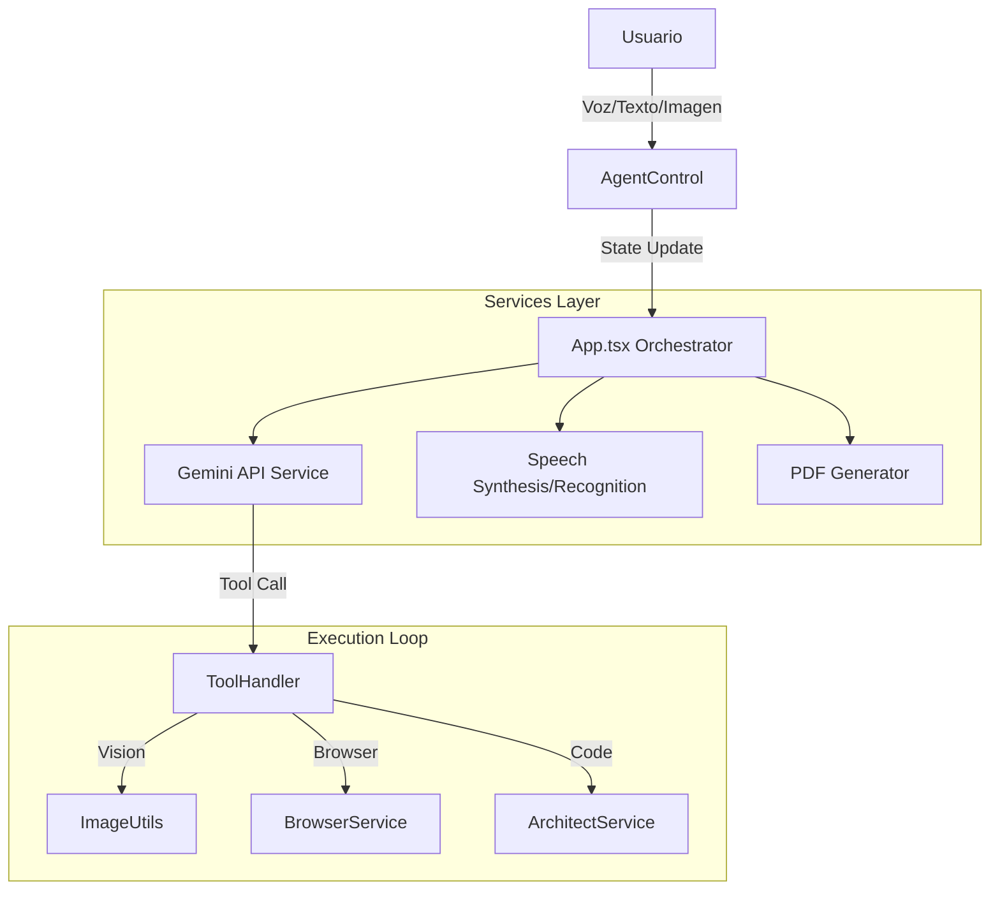

# ⚙️ AGENTNAMIX: Manual del Desarrollador & Arquitectura

Este documento proporciona una visión técnica profunda de la arquitectura, el flujo de datos y la estructura de código de **AGENTNAMIX**. Está diseñado para colaboradores, mantenedores y desarrolladores que deseen extender la funcionalidad del sistema.

---

## 🏗️ Arquitectura del Sistema

AGENTNAMIX opera como una **SPA (Single Page Application)** construida con React y TypeScript, utilizando un enfoque **Serverless / Client-Side First**.

### Diagrama de Flujo de Datos Actualizado



---

## 📂 Estructura de Directorios

```bash
/
├── components/             # Componentes de UI
│   ├── AgentControl.tsx    # Panel con soporte para Voz e Imágenes.
│   ├── TaskBoard.tsx       # Lienzo con botones de TTS y Exportación.
│   ├── HelpSystem.tsx      # Modal de ayuda interactivo.
│   └── LogTerminal.tsx     # Consola de logs.
└── services/               # Lógica de Negocio
    ├── gemini.ts           # [CORE] Orquestación multimodal.
    ├── browser.ts          # [ENGINE] Navegación web real (Proxy Jina).
    ├── imageUtils.ts       # [NEW] Procesamiento de imágenes a Base64.
    ├── speech.ts           # [NEW] Web Speech API (STT/TTS).
    ├── report.ts           # [NEW] Generación de PDF (html2pdf).
    ├── architect.ts        # [ENGINE] Renderizado de código y Preview.
    ├── memory.ts           # [UI] Widgets de memoria.
    ├── db.ts               # [DATA] AlaSQL Database.
    └── ...                 # Otros servicios (calendar, drive, fileProcessor).
```

---

## 📚 Referencia Técnica de Servicios Nuevos

### 1. `services/imageUtils.ts` (Visión)
Maneja la entrada multimodal.
*   **`processImageFile(file)`**: Convierte `File` -> `Base64` limpio (sin cabeceras dataURL) para la API de Gemini.
*   **`isValidImageType(file)`**: Valida formatos soportados (JPEG, PNG, WEBP, HEIC).

### 2. `services/speech.ts` (Voz)
Wrapper sobre las APIs nativas del navegador.
*   **`startListening(callback)`**: Usa `webkitSpeechRecognition`. Transcribe audio a texto en tiempo real.
*   **`speakText(markdown)`**: Usa `speechSynthesis`. Incluye una función de limpieza (`cleanMarkdownForSpeech`) que elimina símbolos de código (#, *, links) para que la lectura sea natural.

### 3. `services/report.ts` (Reportes)
Generador de documentos PDF.
*   **`generateMissionReport(tasks, config)`**:
    1.  Crea un DOM virtual invisible.
    2.  Aplica estilos CSS específicos para impresión (fondo blanco, tinta negra).
    3.  Renderiza el Markdown de cada tarea completada.
    4.  Usa `html2pdf.js` para rasterizar y descargar el archivo.

### 4. `services/architect.ts` (Código)
*   **`createArchitectWidget`**: Genera un visor HTML con árbol de archivos y pestañas.
*   **`assemblePreview`**: Detecta `index.html`, inyecta CSS/JS dependientes y renderiza el resultado en un `<iframe>` aislado (sandbox) para vista previa segura.

---

## 🔧 Notas de Implementación

*   **Multimodalidad**: En `gemini.ts`, el array `contents` ahora soporta objetos mixtos (`{ text: ... }, { inlineData: ... }`) cuando hay imágenes presentes.
*   **Manejo de Errores 429**: Se implementó un "Exponential Backoff" en `gemini.ts` para reintentar peticiones cuando la API de Google está saturada.
*   **Safety Settings**: Se establecieron en `BLOCK_NONE` para evitar falsos positivos al generar código o analizar contenido web.

---

**AGENTNAMIX Dev Team**
